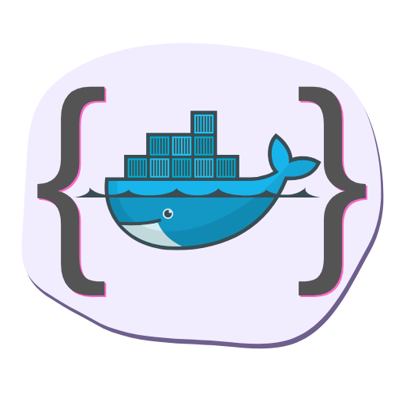
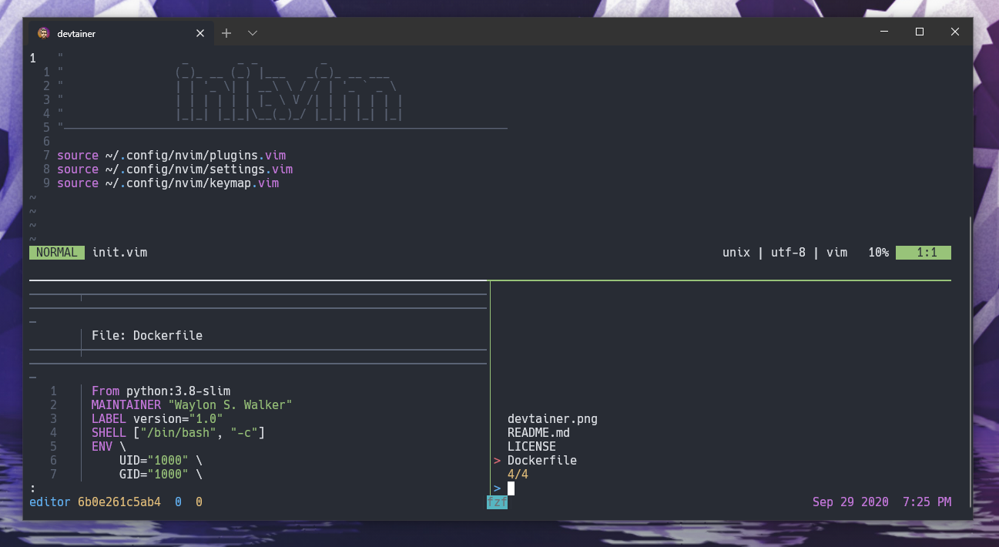

<p align='center'>

</p>
<h1 align='center'>devtainer</h1>


My personal development docker container base image

---

## Container development (legacy)

``` bash
sudo apt update
sudo apt install python3-pip
pip install pipx
~/.local/bin/pipx ensurepath
```

## GNOME desktop migration

On `iron` (or another Ubuntu GNOME machine), clone this repo first, then run
the root bootstrap from your **active GNOME login as your normal user**:

```bash
cd /path/to/devtainer
./bootstrap --dry-run  # preview only; does not install, change, or validate the setup
./bootstrap
```

The bootstrap checks its dependencies and installs only missing packages
(no system upgrade), using `sudo apt` only if needed. Existing `ffplay`
installations are accepted without its apt package; Neovim is installed
through mise rather than apt. On managed machines, your account must be
permitted to install any missing packages;
otherwise check `sudo -l` or ask your administrator before rerunning. It then
stows `git`, `zsh`, `tmux`, `nvim`, `bin`, `gnome`, `herdr`, and `mise` into your home directory
and runs the repo's GNOME settings script. It checks for stow conflicts before
linking and will not adopt or overwrite existing files: move or back up any
reported conflicts yourself, then rerun. The `herdr` Stow package contains
its configuration; its binary is installed through mise.
The `bin` package includes `wfetch`, which displays without color if `lolcat`
is unavailable. Stow keeps directories real rather than linking whole folders,
so mise settings and downloaded fonts cannot end up inside the checkout.
The bootstrap runs directly from this checkout.

If mise is not already installed, bootstrap uses the [official `mise.run`
installer](https://mise.jdx.dev/installing-mise.html) to install it to
`~/.local/bin/mise` without sudo. This requires network access to `mise.run`;
the installer does not change your shell files. Bootstrap stows the global fragment
`~/.config/mise/conf.d/devtainer.toml` (the global tools used on this machine,
plus `uv` and Python 3.10), then installs all globally configured tools as your
user without sudo. It leaves your existing `~/.config/mise/config.toml` alone;
that file can override versions in the fragment. Edit the tracked fragment to
add more shared tools. Open a new Zsh session afterward to activate mise.
Bootstrap also installs JetBrainsMono Nerd Font (regular, bold, italic, and
bold italic) into `~/.local/share/fonts` and refreshes the font cache; no sudo
is needed. It verifies the font downloads against pinned checksums.
If `agent-browser` cannot find a browser, run `agent-browser install` as your
user to download its browser binary; system browser dependencies may still
require administrator help on a managed machine.

Bundled extensions support GNOME Shell **45-48** only; bootstrap stops on
unsupported versions. After installing extensions for the first time, sign out
and back in, then rerun `./bootstrap` to enable them and resolve shortcut
conflicts. The setup is safe to rerun when links already point to this checkout.

The bootstrap does not restore display layout (`~/.config/monitors.xml`),
installed themes or other third-party extensions, or every desktop preference.
Review those separately on a new machine. Do not commit a full dconf dump:
it can include private application settings and machine-specific paths.

# Motivation

This container comes pre-built with all of my favorite command line tools that
I use most often.  I was getting sick of how much system resources vscode hogs
up by the end of the day when I get many different projects open all at once.
Nothing against VSCode, it's a great product, it just takes a lot of resources.
Editors like VScode are great for editing full projects, but often I just want
to quickly browse through a project with all of my favorite tools handy.  Even
though this container is a bit bulky its startup performance has been superior
to VSCode and even neovim inside of wsl.

---

# Screenshot September 30, 2020

<p align='center'>

</p>

---

# Startup Alias

If your on windows like me it is handy to convert wsl paths to windows paths.
If you are not on windows simply use `$pwd` isntead of `$wwd`.

``` bash
# windows working directory
wwd(){pwd | sed 's|/mnt/c|C:|g' | sed "s|/|\\\|g"}
```

Startup with setup shared from parent machine.

``` bash
devtainer () {
 docker run -it --rm \
 -v "$(wwd)":/src \
 -v $HOME/.aws:/root/.aws \
 -v $HOME/.zsh_history:/root/.zsh_history \
 -v $HOME/.git-credentials:/root/.git-credentials \
 -v $HOME/.gitconfig:/root/.gitconfig \
 -v $HOME/.ipython:/root/.ipython \
 waylonwalker/devtainer 
 $@
}
```

Open directly into vim with fzf.vim open.

``` bash
vim () {
 docker run -it --rm \
 -v "$(wwd)":/src \
 -v $HOME/.aws:/root/.aws \
 -v $HOME/.zsh_history:/root/.zsh_history \
 -v $HOME/.git-credentials:/root/.git-credentials \
 -v $HOME/.gitconfig:/root/.gitconfig \
 -v $HOME/.ipython:/root/.ipython \
 waylonwalker/devtainer 
 vim +GFiles
}
```

Open with a specific tmux layout.

``` bash
tmux () {
 docker run -it --rm \
 -v "$(wwd)":/src \
 -v $HOME/.aws:/root/.aws \
 -v $HOME/.zsh_history:/root/.zsh_history \
 -v $HOME/.git-credentials:/root/.git-credentials \
 -v $HOME/.gitconfig:/root/.gitconfig \
 -v $HOME/.ipython:/root/.ipython \
 waylonwalker/devtainer 
 bash -c "tmux new-session -t 'editor' -d;\
    tmux send-keys 'echo hello' Enter;\
    tmux split-window -v 'zsh';
    tmux send-keys nvim Space /src/ Space +GFiles C-m; \
    tmux rotate-window; \
    tmux select-pane -U; \
    tmux -2 attach-session -d
    "
}
```

---

# CLI Tools

* ag
* awscli
* bat
* black
* diff-so-fancy
* flake8
* forgit
* git
* gitui
* glow
* interrogate
* ipython
* make
* markserv
* mypy
* neovim
* nodejs
* oh-my-zsh
* pre-commit
* python
* ripgrep
* tmux
* vifm
* visidata
* zsh

# Vim Plugins

* SirVer/ultisnips
* airblade/vim-gitgutter
* ambv/black
* amix/vim-zenroom2
* easymotion/vim-easymotion
* epilande/vim-es2015-snippets
* epilande/vim-react-snippets
* honza/vim-snippets
* itchyny/lightline.vim
* junegunn/fzf
* junegunn/fzf.vim
* junegunn/goyo.vim
* junegunn/limelight.vim
* justinmk/vim-sneak
* mbbill/undotree
* michaeljsmith/vim-indent-object
* rakr/vim-one
* ryanoasis/vim-devicons
* scrooloose/nerdtree
* scrooloose/syntastic
* terryma/vim-smooth-scroll
* thinca/vim-visualstar
* tpope/vim-commentary
* tpope/vim-fugitive
* tpope/vim-markdown
* tpope/vim-surround
* valloric/matchtagalways
* valloric/youcompleteme
* vim-scripts/AutoComplPop
* w0rp/ale
* wellle/targets.vim
